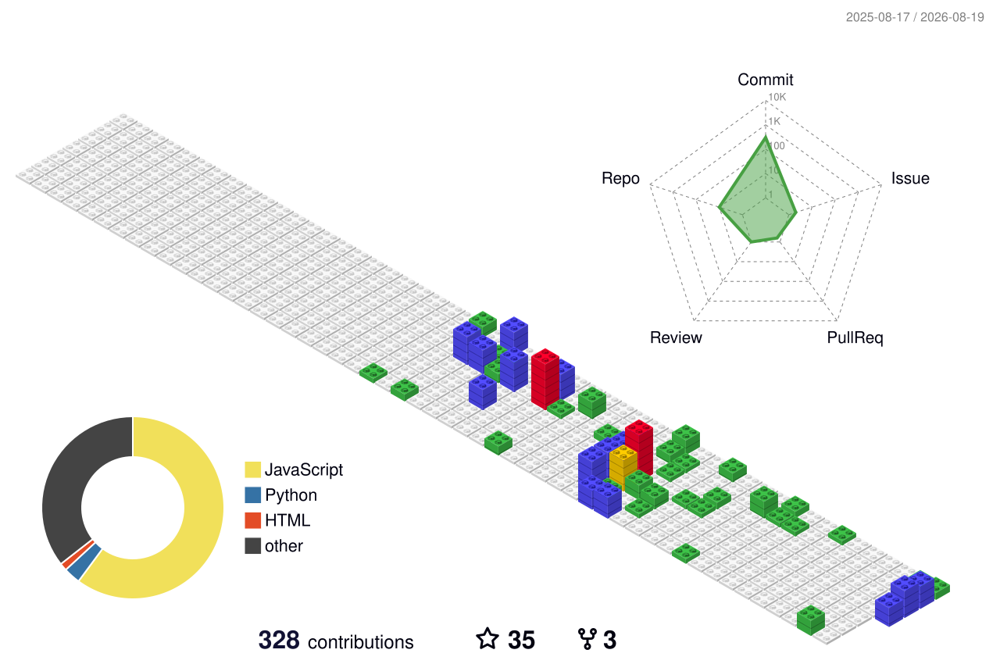

<picture>
  <source media="(prefers-color-scheme: dark)" srcset="./assets/banner-dark.svg">
  
</picture>

 

---

I take platforms apart to see how they actually work, then build the tool I wanted while I was taking them apart. All of it is a hobby, all of it is open source, and none of it is a product.

Two rules I hold to. **Nothing runs faster than a person would**, because the whole difficulty in this space is pacing, not access. And **nothing asks for your password**, because a console script running inside a page you already logged into never needs one.

---

<picture>
  <source media="(prefers-color-scheme: dark)" srcset="./assets/s-build-dark.svg">
  
</picture>

### 🎨 Design

| | |
|---|---|
| **[Vantagraph](https://github.com/Miabeyefendi/Vantagraph)** | A modular Spicetify theme for Spotify. 11 hand-tuned palettes, an in-app settings panel, 66 hand-drawn icons, a picture-in-picture lyric karaoke window and a taskbar player.      |

### 🎮 Steam

| | |
|---|---|
| **[SteamEdge](https://github.com/Miabeyefendi/SteamEdge)** | Farm trading cards, bank playtime and manage achievements without ever opening the Steam client. Speaks Steam's own network protocol.      |

### 🎬 Letterboxd

| | |
|---|---|
| **[Letterboxd-Munfollow](https://github.com/Miabeyefendi/Letterboxd-Munfollow)** | Find who never followed you back, then unfollow, block or unblock in bulk. Five filters, anti-ban pacing, TXT export.     |
| **[Letterboxd-Masfollow](https://github.com/Miabeyefendi/Letterboxd-Masfollow)** | The other direction. Target a profile's following list, a member search or a list's fans, filter out the dead accounts, follow at a human pace.     |

### 📸 Instagram

| | |
|---|---|
| **[IG-DMKeep](https://github.com/Miabeyefendi/IG-DMKeep)** | Save your own conversations before you lose them. Full history with media, exported to JSON, TXT, Markdown or a ZIP, entirely in the browser.     |
| **[IG-Munfollow](https://github.com/Miabeyefendi/IG-Munfollow)** | See who does not follow you back and unfollow in bulk. Seven filters, follow-date sorting, randomised pacing.    |
| **[IG-Munliker](https://github.com/Miabeyefendi/IG-Munliker)** | Clear the like history without looking like a script. Real device emulation, ordinary browsing mixed in between actions.     |

### 🧠 Other

| | |
|---|---|
| **[llm-prompts-collection](https://github.com/Miabeyefendi/llm-prompts-collection)** | 63 prompts in eleven categories, kept as plain text so what you copy is exactly what was written.    |

Every repository is documented in <b>English, Türkçe, Español, 简体中文 and Русский</b>.

---

<picture>
  <source media="(prefers-color-scheme: dark)" srcset="./assets/s-stack-dark.svg">
  
</picture>

Reverse engineering · browser automation · protocol work · anti-detection pacing · UI and theme design

---

<picture>
  <source media="(prefers-color-scheme: dark)" srcset="./assets/s-activity-dark.svg">
  
</picture>

  

 

 

<picture>
  <source media="(prefers-color-scheme: dark)" srcset="./assets/snake-dark.svg">
  
</picture>

 

All three are rendered by a scheduled action and committed into this repository as files. Nothing on this page is fetched from someone else's server at the moment you read it.

---

<picture>
  <source media="(prefers-color-scheme: dark)" srcset="./assets/s-reach-dark.svg">
  
</picture>

  

 

<b>@miabeyefendi</b> everywhere. Commercial licensing enquiries through the GitHub profile.

  

<i>If it can be automated, it should be. Slowly.</i>

