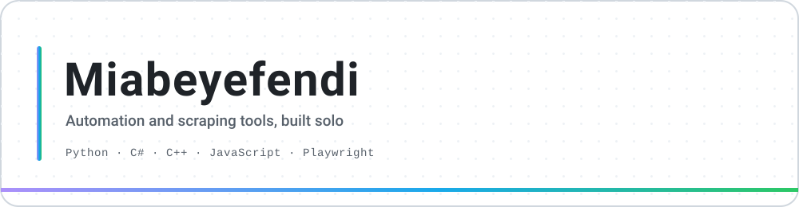
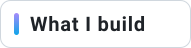
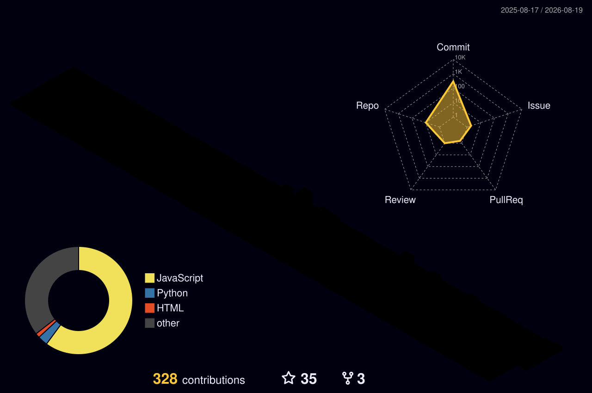

<picture>
  <source media="(prefers-color-scheme: dark)" srcset="./assets/banner-dark.svg">
  
</picture>

  

---

### I take a platform apart, then build the tool I wanted while I was inside it.

Eight of them so far. A Spotify theme with its own settings engine, a Steam client 
replacement that never opens Steam, and a shelf of automation tools that all obey 
the same two rules: **never faster than a person**, and **never ask for a password**.

---

<picture>
  <source media="(prefers-color-scheme: dark)" srcset="./assets/s-build-dark.svg">
  
</picture>

 

| | |
|---|---|
| 🎨 **[Vantagraph](https://github.com/Miabeyefendi/Vantagraph)** | Spicetify theme for Spotify. 11 palettes, in-app settings panel, 66 hand-drawn icons, PiP lyric karaoke |
| 🎮 **[SteamEdge](https://github.com/Miabeyefendi/SteamEdge)** | Farms cards, banks playtime and writes achievements by speaking Steam's protocol. Steam never opens |
| 🎬 **[Letterboxd-Munfollow](https://github.com/Miabeyefendi/Letterboxd-Munfollow)** | Finds who never followed back. Unfollow, block or unblock in bulk |
| 🎬 **[Letterboxd-Masfollow](https://github.com/Miabeyefendi/Letterboxd-Masfollow)** | The other direction. Targets real accounts, skips the dead ones |
| 📨 **[IG-DMKeep](https://github.com/Miabeyefendi/IG-DMKeep)** | Saves your own Instagram conversations, media included, entirely in the browser |
| 📸 **[IG-Munfollow](https://github.com/Miabeyefendi/IG-Munfollow)** | Seven filters over your following list, then bulk unfollow |
| 🐍 **[IG-Munliker](https://github.com/Miabeyefendi/IG-Munliker)** | Clears the like history while behaving like a phone, not a loop |
| 🧠 **[llm-prompts-collection](https://github.com/Miabeyefendi/llm-prompts-collection)** | 63 prompts, eleven categories, plain text so nothing is mangled on the way out |

Every one of them is documented in <b>English · Türkçe · Español · 简体中文 · Русский</b>

---

<picture>
  <source media="(prefers-color-scheme: dark)" srcset="./assets/snake-dark.svg">
  
</picture>

 

 

<i>If it can be automated, it should be. Slowly.</i>

